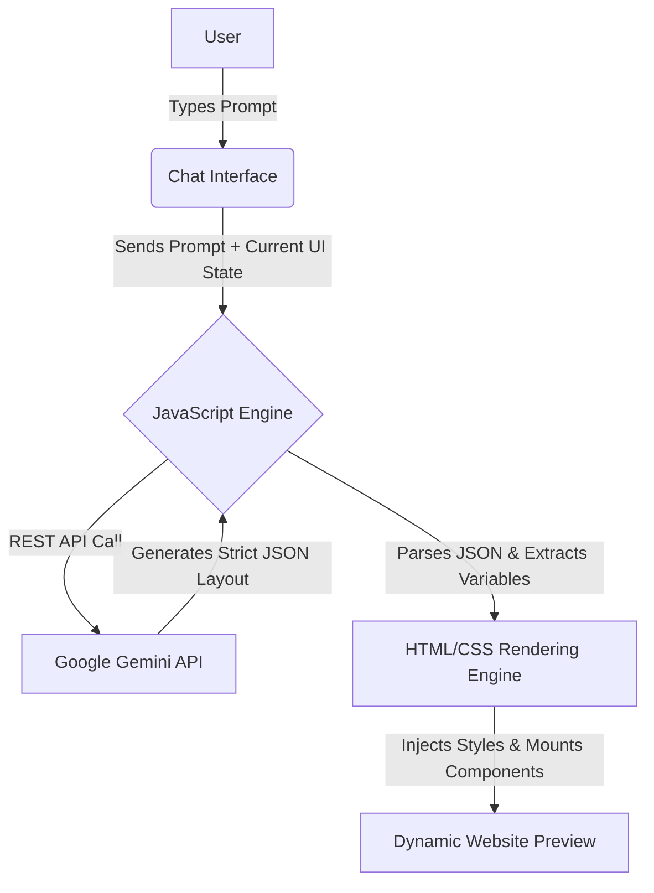

<div align="center">
  <h1>NexSite AI 🚀</h1>
  <p><b>An intelligent Generative AI copilot that builds and designs websites from natural language prompts.</b></p>
  
  
  
  
  
  
  
</div>

---

## 📖 Table of Contents
- [About the Project](#-about-the-project)
- [Key Features](#-key-features)
- [Architecture & Flowchart](#-architecture--flowchart)
- [Project Structure](#-project-structure)
- [Getting Started](#-getting-started)
- [Technologies Used](#-technologies-used)
- [License](#-license)

---

## 🚀 About the Project
NexSite AI empowers developers and designers to generate and iteratively refine custom, highly-visual website layouts simply by typing natural language prompts. By leveraging the **Google Gemini API**, it translates conversational requests into strict, structured JSON data, which is then mapped instantly onto dynamic UI templates.

---

## 🌟 Key Features
- **Prompt-to-Website Generation:** Describe your website, and the AI builds it dynamically.
- **Dynamic Theming System:** Instantly swaps between Dark, Light, Brutalist, Purple, and other vibrant themes without rewriting CSS.
- **Iterative Refinement (100% State Retention):** Ask the AI to change specific sections (e.g., "Change the background to a grid") without losing your previous layout.
- **Modular Components:** Supports 10+ AI-mappable sections including Hero, Pricing, FAQ, Testimonials, and Editorial grids.
- **Dual Architecture:** Contains both a modern React/Vite implementation and a lightning-fast pure Vanilla HTML/CSS/JS implementation.

---

## 🧠 Architecture & Flowchart



---

## 📁 Project Structure

This repository contains two complete versions of the project:

1. **`nexsite-ai/` (React Version)**: The original implementation utilizing React 19, Vite, Tailwind CSS, and Framer Motion for advanced animations.
2. **`nexsite-ai-vanilla/` (Vanilla Version)**: A completely refactored version using **0 dependencies**. It relies entirely on native HTML5, standard CSS variables, and Vanilla JavaScript (ES6+), interacting directly with the Gemini API via ESM.

---

## 🛠️ Getting Started

To run this project locally, you will need a [Google Gemini API Key](https://aistudio.google.com/app/apikey).

### Option 1: Vanilla HTML/CSS/JS (Zero Setup)
Because this uses pure browser-native code, there are no dependencies to install.
1. Clone the repository: `git clone https://github.com/Santhosh-nakka/nexsite-ai.git`
2. Navigate to the vanilla directory: `cd nexsite-ai-vanilla`
3. Simply double-click `index.html` to open it in your browser.
4. Paste your API key into the sidebar and start building!

### Option 2: Modern React Implementation
1. Clone the repository and navigate to the React folder:
   ```bash
   git clone https://github.com/Santhosh-nakka/nexsite-ai.git
   cd nexsite-ai
   ```
2. Install dependencies:
   ```bash
   npm install
   ```
3. Create a `.env` file in the root of the React project:
   ```env
   VITE_GEMINI_API_KEY=your_key_here
   ```
4. Start the development server:
   ```bash
   npm run dev
   ```

---

## 💻 Technologies Used
- **Generative AI:** Google Gemini API (`gemini-flash-lite-latest`)
- **Frontend Core:** HTML5, CSS3, Vanilla JavaScript (ES6+)
- **React Environment:** React 19, Vite, Tailwind CSS, Framer Motion
- **Tooling:** Git, GitHub, ESLint

---

## 📄 License
Distributed under the MIT License. See `LICENSE` for more information.
