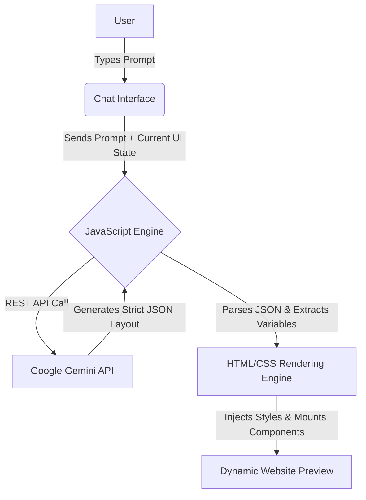

# NexSite AI 🚀

NexSite AI is a Generative AI-powered website builder that acts as an intelligent copilot for web design. It empowers users to generate and iteratively refine custom, highly-visual website layouts simply by typing natural language prompts.

## 🌟 Features
- **Prompt-to-Website:** Describe your website, and the AI builds it dynamically.
- **Dynamic Theming:** Instantly swaps between Dark, Light, Brutalist, Purple, and other vibrant themes.
- **Iterative Refinement:** Ask the AI to change specific sections without losing your previous layout (maintains 100% UI state).
- **Dual Architecture:** Contains both a modern React/Vite implementation and a lightning-fast pure HTML/CSS/Vanilla JS implementation.

## 🧠 Architecture Flowchart

## 🛠️ Technologies Used
- **Generative AI:** Google Gemini API (`gemini-flash-lite-latest`)
- **Frontend Core:** HTML5, CSS3, Vanilla JavaScript (ES6+)
- **React Implementation:** React 19, Vite, Tailwind CSS, Framer Motion

## 🚀 How to Run

### Option 1: Vanilla HTML/CSS/JS (Zero Setup)
1. Navigate to the `nexsite-ai-vanilla` directory.
2. Double-click `index.html` to open it directly in your web browser (no server needed).
3. Enter your Google Gemini API key in the sidebar and start prompting!

### Option 2: Modern React Implementation
1. Navigate to the `nexsite-ai` directory in your terminal.
2. Install dependencies by running `npm install`.
3. Create a `.env` file and add your API key: `VITE_GEMINI_API_KEY=your_key_here`
4. Start the development server by running `npm run dev`.
